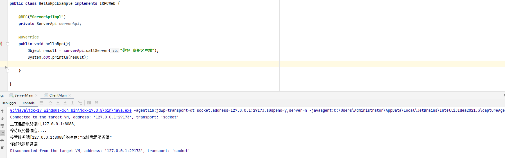

# easy-rpc

#### 介绍
自己动手实现一个简单的rpc框架，一个非常适合入门的rpc demo

#### 你能够学到

1. proxy代理生成
2. 反射高级特性
3. SPI机制（服务提供接口）
4. socket通信
5. 深入理解RPC通信原理

#### 软件架构
jdk1.8+maven+socket+fastjson

#### 安装教程

1. 需提前安装好maven
2. 导入开发工具即可

#### 使用说明

1.  先启动服务端 后启动客户端
2.  编写rpc测试参考客户端示例
3.  编写服务端新接口参考服务端接口实例  

#### 运行demo

1. 服务端

2. 客户端

#### 参与贡献

若发现本项目代码中存在问题，还请指出。